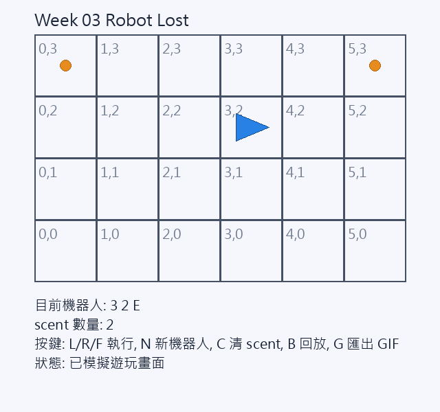

# Week 03 - Robot Lost（pygame + 規則模擬）



## 1. 功能清單

- 依 UVA 118 規則模擬機器人移動
- 完整支援 `L / R / F` 指令
- 支援 `LOST` 與 `scent` 防呆規則
- pygame 互動畫面：
  - 顯示格子地圖
  - 顯示機器人位置與朝向
  - 顯示 scent 標記
  - 可逐步輸入指令
  - 可建立新機器人（保留 scent）
  - 可清除 scent
  - 可回放歷史
  - 可嘗試輸出 `assets/replay.gif`（需 Pillow）

## 2. 執行方式

- Python 版本：建議 3.10+
- 安裝套件：

```bash
pip install pygame pillow
```

- 啟動遊戲：

```bash
python robot_game.py
```

## 3. 測試方式

- 執行指令：

```bash
python -m unittest discover -s tests -p "test_*.py" -v
```

- 結果摘要：
  - 測試檔 2 份
  - 測試函式 15 個
  - 覆蓋旋轉、越界、scent、生效條件與非法指令

## 4. 資料結構選擇理由

- 使用 `set[(x, y, dir)]` 記錄 scent：
  - 查詢時間複雜度平均為 O(1)
  - 可直接把方向納入 key，避免錯誤共用
  - 符合規格「最後位置 + 當前方向」
- 使用 `dataclass RobotState`：
  - 欄位語意清楚（`x, y, direction, lost`）
  - 便於測試比對與除錯
- 核心邏輯與 pygame 分離：
  - `robot_core.py` 純邏輯，便於單測
  - `robot_game.py` 僅處理顯示與互動

## 5. 一個踩到的 bug 與修正

- 問題：一開始 scent 只記錄 `(x, y)`，導致同格不同方向也被錯誤忽略。
- 修正：改成 `(x, y, dir)` 三元組，方向不同時不共用 scent，符合題意。

## 6. 遊玩截圖

- 位置：`assets/gameplay.png`
- 畫面包含地圖、機器人、HUD 與 scent 標記。

## 7. 重播方式說明

- 遊戲內按 `B` 可回放目前機器人的歷史操作。
- 按 `G` 會嘗試匯出 `assets/replay.gif`：
  - 有安裝 Pillow：輸出成功
  - 未安裝 Pillow：會在 HUD 顯示提示

## 操作鍵

- `L / R / F`：執行一步
- `N`：新機器人（保留 scent）
- `C`：清除 scent
- `B`：回放
- `G`：匯出 GIF
- `ESC`：離開
